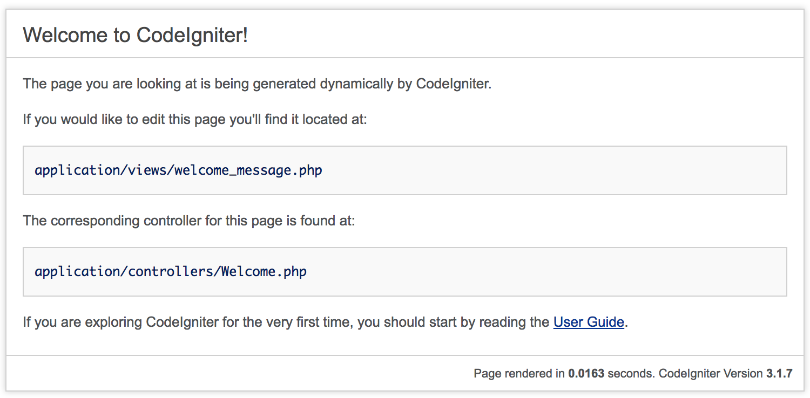

# Pengantar dan Pengenalan Web Framework

## Persiapan

### Perangkat Lunak

* [Xampp](https://apachefriends.org) / [Wamp](http://www.wampserver.com/en/) / (PHP + Apache + MySql)
* Text Editor/IDE
* Git (Referensi: [Try Github](http://try.github.com))

### Editor

> Your editor is your Katana

Perkuliahan ini tidak mewajibkan anda untuk menggunakan suatu text editor/IDE
tertentu (gunakan sesuai preferensi anda).

Beberapa text editor/IDE yang umum digunakan antara lain:
* [Sublime Text 3](https://sublimetext.com/3)
* [Visual Studio Code](https://code.visualstudio.com)
* [Atom](https://atom.io)
* [Notepad++](https://notepad-plus-plus.org)
* [Webstorm](https://jetbrains.com/webstorm)
* [Emacs](https://gnu.org/emacs)
* [Vim](https://vim.org)

Recommended Settings & Plugins

* Linter
  * [Sublime Text 3](https://github.com/SublimeLinter/SublimeLinter-php)
  * [VS Code](https://code.visualstudio.com/docs/languages/php#_linting)
* [Emmet](https://emmet.io/download/)
* CodeIgniter 3 Snippet
* Bootstrap 3 Snippet
* Bootstrap 3 Autocomplete

## Instalasi CodeIgniter

{{'https://www.youtube.com/watch?v=4gIm35pDNSo'|video}}
Unduh paket CodeIgniter 3 pada halaman [CodeIgniter
Download](https://codeigniter.com/download). Pastikan versi yang diunduh adalah
versi 3.x (versi saat modul ini ditulis adalah 3.1.7).

Panduan lebih lengkap dapat dilihat di [Docs CodeIgniter
3](https://www.codeigniter.com/userguide3/installation/index.html)

## Konfigurasi CodeIgniter

File-file yang berkaitan dengan konfigurasi CodeIgniter, antara lain:

* `application/config/config.php`
* `application/config/database.php`
* `application/config/routes.php`

## Instalasi Twitter Bootstrap

Untuk menginstall Twitter Bootstrap, unduh pada halaman [Download Twitter
Bootstrap](http://getbootstrap.com/getting-started/#download). Kemudian ekstrak
file yang telah didownload, sehingga didapatkan struktur direktori seperti
berikut:

```
bootstrap-3.3.7-dist
├── css
│   ├── bootstrap-theme.css
│   ├── bootstrap-theme.css.map
│   ├── bootstrap-theme.min.css
│   ├── bootstrap-theme.min.css.map
│   ├── bootstrap.css
│   ├── bootstrap.css.map
│   ├── bootstrap.min.css
│   └── bootstrap.min.css.map
├── fonts
│   ├── glyphicons-halflings-regular.eot
│   ├── glyphicons-halflings-regular.svg
│   ├── glyphicons-halflings-regular.ttf
│   ├── glyphicons-halflings-regular.woff
│   └── glyphicons-halflings-regular.woff2
└── js
    ├── bootstrap.js
    ├── bootstrap.min.js
    └── npm.js
```

### Percobaan Twitter Bootstrap

* Buatlah direktori dengan nama `hello-bootstrap` pada direktori `htdocs` web server.
* Tambahkan file `index.php` pada direktori tersebut.
* Copy file `css`, `js` serta `font` ke dalam direktori, sehingga terbentuk struktur seperti berikut.

```
hello-bootstrap
├── css
├── font
├── index.php
└── js
```

* Buatlah struktur dasar html seperti di bawah ini

```html
<!DOCTYPE html>
<html>
<head>
<title>Hello Bootstrap</title>
</head>
<body>

</body>
</html>
```

* Tambahkan css bootstrap pada bagian `head`.

```html
<link href="css/bootstrap.min.css" rel="stylesheet">
```

* Tambahkan js bootstrap dan jquery pada bagian akhir `body`.

```html
<script src="js/jquery-3.3.1.min.js"></script>
<script src="js/bootstrap.min.js"></script>
```

> Twitter Bootstrap membutuhkan jquery, download jquery pada link berikut:
> [Download jquery](https://jquery.com/download/)

* Tuliskan kode berikut untuk menampilkan isi halaman.

```html
<h1 class="text-center">Hello Bootstrap</h1>
```

## Integrasi Twitter Bootstrap dengan CodeIgniter

* Ekstrak file Twitter Bootstrap yang telah diunduh (`css`, `js`, `font`).

* Buatlah folder `assets`

* Copykan ketiga folder `css`, `js` dan `font` ke dalam folder assets dari
 framework CodeIgniter 3, sehingga struktur direktori kurang lebih seperti
 berikut.

 ```
codeigniter
├── application
│   ├── ...
├── assets
│   ├── css
│   ├── fonts
│   └── js
├── composer.json
├── contributing.md
├── index.php
├── license.txt
├── readme.rst
├── system
│   ├── ...
└── user_guide
    ├── ...
 ```

 * Modifikasi file `view/welcome_message.php`



*
