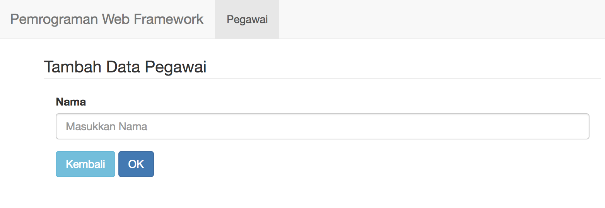

# CRUD dan Form Validation

Dalam pertemuan sebelumnya, telah dikenalkan dengan paradigma MVC, untuk
pembuatan CRUD pada modul ini akan menerapkan konsep tersebut.

## Percobaan

Pada percobaan ini, akan dibuat proses CRUD untuk entitas pegawai. Siapkan
struktur direktori dan database berikut pada project codeigniter anda!

```sql
CREATE TABLE `pegawai` (
  `id` int(11) unsigned NOT NULL AUTO_INCREMENT,
  `nama` varchar(50) DEFAULT NULL,
  PRIMARY KEY (`id`)
)
```

```
codeigniter
├── application
│   ├── config
│   ├── controllers
│   │   ├── Pegawai.php
│   │   └── index.html
│   ├── models
│   │   ├── Pegawai_model.php
│   │   └── index.html
│   └── views
│       ├── index.html
│       ├── layouts
│       │   ├── base_end.php
│       │   ├── base_start.php
│       │   ├── footer.php
│       │   └── header.php
│       └── pegawai
│           ├── create.php
│           ├── edit.php
│           ├── index.php
│           └── show.php
```

Dalam percobaan CRUD akan banyak menggunakan template view yang hampir serupa,
sehingga diperlukan template layouts yang bisa digunakan berulang. Perhatikan
pada direktori `application/views/layouts`.

```php
<!-- base_start.php -->
<!DOCTYPE html>
<html lang="en">
<head>
  <meta charset="utf-8">
  <meta http-equiv="X-UA-Compatible" content="IE=edge">
  <meta name="viewport" content="width=device-width, initial-scale=1">
  <title><?php isset($title) ?: $title = 'Pemrograman Web Berbasis Framework'; echo $title ?></title>
  <link href="<?php echo base_url('assets/css/bootstrap.min.css') ?>" rel="stylesheet">
  <style>
    .footer {
      position: absolute;
      bottom: 0;
      width: 100%;
      height: 60px;
      background-color: #f5f5f5;
    }

    .container .text-footer {
      margin: 20px 0;
    }

  </style>
</head>
<body>
  <?php $this->load->view('layouts/header') ?>
```

```php
<!-- base_end.php -->
    <?php $this->load->view('layouts/footer') ?>
    <script src="<?php echo base_url('assets/js/jquery.min.js') ?>"></script>
    <script src="<?php echo base_url('assets/js/bootstrap.min.js') ?>"></script>
  </body>
</html>
```

```php
<!-- header.php -->
<nav class="navbar navbar-default" role="navigation">
  <!-- Brand and toggle get grouped for better mobile display -->
  <div class="navbar-header">
    <button type="button" class="navbar-toggle" data-toggle="collapse" data-target=".navbar-ex1-collapse">
      <span class="sr-only">Toggle navigation</span>
      <span class="icon-bar"></span>
      <span class="icon-bar"></span>
      <span class="icon-bar"></span>
    </button>
    <a class="navbar-brand" href="<?php echo base_url() ?>">
      Pemrograman Web Framework
    </a>
  </div>

  <!-- Collect the nav links, forms, and other content for toggling -->
  <div class="collapse navbar-collapse navbar-ex1-collapse">
    <ul class="nav navbar-nav">
      <li class="active"><a href="<?php echo site_url('pegawai/') ?>">Pegawai</a>
    </ul>
  </div><!-- /.navbar-collapse -->
</nav>
```

```php
<!-- footer.php -->
<footer class="footer">
  <div class="container">
    <p class="text-footer">
      Hak Cipta <a href="https://github.com/dosenhub">DosenHub</a>
    </p>
  </div>
</footer>
```

* Buat pegawai model untuk membagi logic aplikasi dari dan ke database.

```php
<?php
// models/Pegawai_model.php

class Pegawai_model extends CI_Model {

}
```

* Buat controller pegawai

```php
<?php
// controllers/Pegawai.php

class Pegawai extends CI_Controller {

}
```

* Pada controller, anda dapat memanfaatkan constructor untuk load `helper`,
`library` atau `model`. Anda juga dapat mendefinisikannya di `config/autoload.php`
sehingga dapat terload secara otomatis.

```php
public function __construct()
{
  parent::__construct();
  $this->load->helper('url', 'form');
  $this->load->library('form_validation');
  $this->load->model('Pegawai_model');
}
```

> Silahkan baca dokumentasi mengenai [url](https://www.codeigniter.com/user_guide/helpers/url_helper.html), [form](https://www.codeigniter.com/user_guide/helpers/form_helper.html), [form_validation](https://www.codeigniter.com/user_guide/libraries/form_validation.html).

* Untuk menampilkan data yang telah tersimpan di database, buatlah fungsi list
di dalam model pegawai.

```php
// models/Pegawai_model.php

public function list()
{
  $query = $this->db->get('pegawai');
  return $query->result();
}
```

* Pada controller pegawai, implementasikan untuk memanggil list data.

```php
public function index()
{
  $pegawai = $this->pegawai_model
    ->list();
  $data = [
    'title' => 'Pemrograman Web Framework :: Data Pegawai',
    'pegawai' => $pegawai
  ];
  $this->load->view('pegawai/index', $data);
}
```

* Pada view `pegawai/index.php` buatlah tabel yang menampilkan data dari
database.

```php
<?php $this->load->view('layouts/base_start') ?>

<div class="container">
  <legend>Daftar Pegawai</legend>
  <div class="col-xs-12 col-sm-12 col-md-12">
    <table class="table table-striped">
      <thead>
        <th>No</th>
        <th>Nama</th>
        <th>
          <a class="btn btn-primary" href="<?php echo site_url('pegawai/create') ?>">
            Tambah
          </a>
        </th>
      </thead>
      <tbody>
        <?php $number = 1; foreach($pegawai as $row) { ?>
        <tr>
          <td>
            <a href="<?php echo site_url('pegawai/show/'.$row->id) ?>">
              <?php echo $number++ ?>
            </a>
          </td>
          <td>
            <a href="<?php echo site_url('pegawai/show/'.$row->id) ?>">
              <?php echo $row->nama ?>
            </a>
          </td>
          <td>
            <?php echo form_open('pegawai/destroy/'.$row->id)  ?>
            <a class="btn btn-info" href="<?php echo site_url('pegawai/edit/'.$row->id) ?>">
              Ubah
            </a>
            <button type="submit" class="btn btn-danger" onclick="return confirm('Apakah anda yakin?')">Hapus</button>
            <?php echo form_close() ?>
          </td>
        </tr>
        <?php } ?>
      </tbody>
    </table>
  </div>
</div>

<?php $this->load->view('layouts/base_end') ?>
```

* Buatlah tampilan untuk form penambahan data pegawai

```php
<?php $this->load->view('layouts/base_start') ?>

<div class="container">
  <legend>Tambah Data Pegawai</legend>
  <div class="col-xs-12 col-sm-12 col-md-12">
  <?php echo form_open('pegawai/store'); ?>

    <div class="form-group">
      <label for="Nama">Nama</label>
      <input type="text" class="form-control" id="nama" name="nama" placeholder="Masukkan Nama">
    </div>

    <a class="btn btn-info" href="<?php echo site_url('pegawai/') ?>">Kembali</a>
    <button type="submit" class="btn btn-primary">OK</button>
  <?php echo form_close() ?>
  </div>
</div>

<?php $this->load->view('layouts/base_end') ?>
```

* Pada controller, load tampilan view tersebut seperti berikut.

```php
public function create()
{
  $this->load->view('pegawai/create');
}
```

* Coba akses form tambah pegawai melalui tombol tambah, sehingga muncul tampilan
sebagai berikut.



* Untuk memasukkan data, dibutuhkan fungsi penambahan data pada model pegawai.

```php
// models/Pegawai_model.php

public function insert($data = [])
{
  $result = $this->db->insert('pegawai', $data);
  return $result;
}
```

* Panggil fungsi penambahan data pada model di controller pegawai.

```php
public function store()
{
  $data = ['nama' => $this->input->post('nama')];
  $rules = [
    [
      'field' => 'nama',
      'label' => 'Nama',
      'rules' => 'trim|required'
    ]
  ];
  // Untuk rule sederhana bisa dengan menggunakan
  // $this->form_validation->set_rules('nama', 'Nama', 'trim|required');
  $this->form_validation->set_rules($rules);

  if ($this->form_validation->run()) {
    $result = $this->pegawai_model->insert($data);
    if ($result) {
      redirect('pegawai');
    }
  } else {
    redirect('pegawai/create');
  }
}
```

* Pada proses ini, dibutuhkan validasi data yang dikirimkan ke controller. Untuk
proses ini dapat memanfaatkan library CI `form_validation`.

* Jika proses penambahan berhasil, tampilan akan diarahkan ke url `pegawai`
dengan `redirect`

* Jika ada kesalahan dalam validasi data, akan dikembalikan ke halaman tambah
pegawai `pegawai/create`.

* Untuk melihat detil data yang telah dimasukkan, implementasikan tampilan untuk
view data berikut.

```php
<?php $this->load->view('layouts/base_start') ?>

<div class="container">
  <legend>Lihat Pegawai</legend>
  <div class="content">
    <div class="form-group">
      <label for="nama">Nama</label>
      <p><?php echo $data->nama ?></p>
    </div>
    <a class="btn btn-info" href="<?php echo site_url('pegawai/') ?>">Kembali</a>
  </div>
</div>

<?php $this->load->view('layouts/base_end') ?>
```

* Load tampilan pada controller

```php
public function show($id)
{
  $pegawai = $this->pegawai_model->show($id);
  $data = [
    'data' => $pegawai
  ];
  $this->load->view('pegawai/show', $data);
}
```

* Data yang telah dimasukkan dapat dilihat melalui pola url `pegawai/show/id`
(id merupakan nilai id pada database).

# Tugas Praktikum

* Dengan menggunakan pendekatan yang sama, lengkapi implementasi project untuk
fitur `update` dan `delete` sehingga menjadi aplikasi CRUD yang utuh. Untuk view
tampilan, anda dapat menggunakan template yang ada pada bagian **Lampiran**

# Lampiran

```php
<!-- pegawai/edit.php -->

<?php $this->load->view('layouts/base_start') ?>

<div class="container">
  <legend>Tambah Data Pegawai</legend>
  <div class="col-xs-12 col-sm-12 col-md-12">
  <?php echo form_open('pegawai/update/'.$data->id); ?>
    <?php echo form_hidden('id', $data->id) ?>
    <div class="form-group">
      <label for="Nama">Nama</label>
      <input type="text" class="form-control" id="nama" name="nama" placeholder="Masukkan Nama" value="<?php echo $data->nama ?>">
    </div>

    <a class="btn btn-info" href="<?php echo site_url('pegawai/') ?>">Kembali</a>
    <button type="submit" class="btn btn-primary">OK</button>
  <?php echo form_close(); ?>
  </div>
</div>

<?php $this->load->view('layouts/base_end') ?>
```

```php
<?php

class Pegawai_model extends CI_Model {

  public function list()
  {
    // ...
  }

  public function insert($data = [])
  {
    // ...
  }

  public function show($id)
  {
    // ...
  }

  public function update($id, $data = [])
  {
    // TODO: set data yang akan di update
    // https://www.codeigniter.com/userguide3/database/query_builder.html#updating-data
  }


  public function delete($id)
  {
    // TODO: tambahkan logic penghapusan data
  }

}
```

```php
<?php

defined('BASEPATH') OR exit('No direct script access allowed');

class Pegawai extends CI_Controller {

    public function __construct()
    {
      // ...
    }


    public function index()
    {
      // ...
    }

    public function create()
    {
      // ...
    }

    public function store()
    {
      // ...
    }

    public function show($id)
    {
      // ...
    }

    public function edit($id)
    {
      // TODO: tampilkan view edit data
    }

    public function update($id)
    {
      // TODO: implementasi update data berdasarkan $id
    }

    public function destroy($id)
    {
      // TODO: implementasi penghapusan data berdasarkan $id
    }

}

/* End of file Pegawai.php */
```
