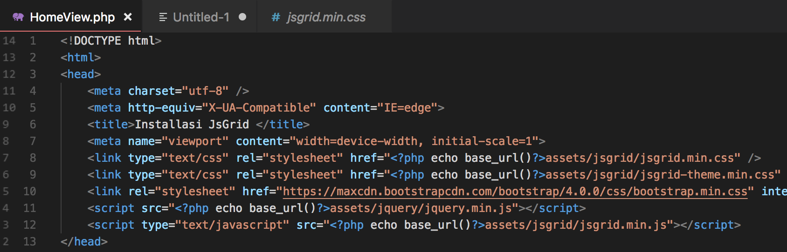
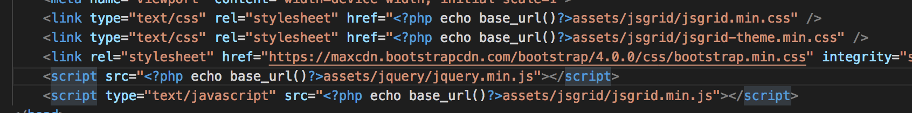
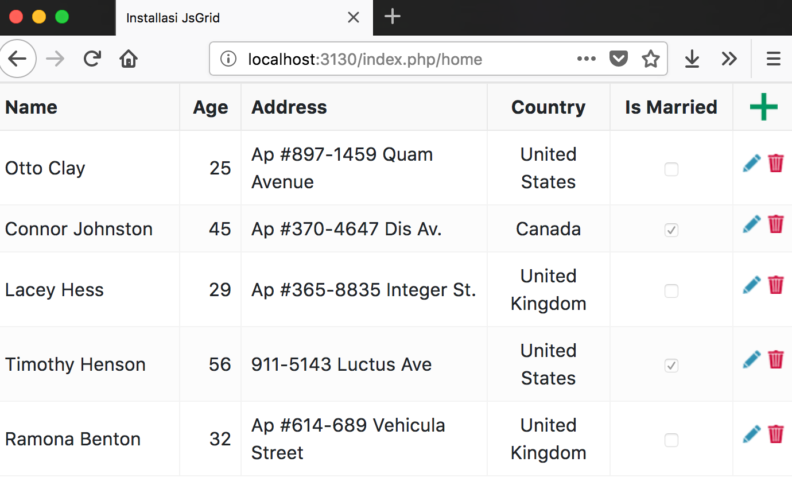

# CRUD dengan Datagrid

Pada percobaan kali ini akan dipelajari bagaimana cara menambahkan grid (berbasis javascript) ke project codeigniter. Percobaan kali ini akan menggunakan library js-grid yang dapat di download melalui url : http://js-grid.com

## Percobaan 1 : Installasi Codeigniter

1.  Mulailah dengan sebuah installasi codeigniter baru.
2.  Lakukan konfigurasi agar dapat terkoneksi ke database `config/database.php` dan autoload library `config/autoload.php` yang dibutuhkan untuk proses CRUD sesuai dengan modul pada bab sebelumnya.
3.  Buatlah sebuah controller dengan nama Home.php, view dengan nama HomeView.php.
4.  Buatlah sebuah function di controller Home.php dengan nama index() yang di dalam function tersebut melakukan load view HomeView.php.
5.  Pada file HomeView.php tambahkan sebuah tulisan sederhana "Home View"

Jika langkah 1 - 5 dilakukan dengan benar maka akan muncul tampilan seperti ini jika anda membuka url `/index.php/home`


## Percobaan 2 : Installasi Js Grid

1.  Buatlah sebuah folder asset yang didalamnya terdapat folder jquery yang memuat file javascript untuk jquery latest file jquery dapat di download melalui url berikut ini : https://code.jquery.com/jquery-3.3.1.min.js
2.  Selain itu buatlah folder jsgrid yang memuat file library jsgrid yang dapat di download melalui url berikut ini : https://github.com/tabalinas/jsgrid/releases/download/v1.5.3/jsgrid-1.5.3.zip
3.  Pada HomeView.php tambahkan sebuah template html5 standar dan beri title Installasi JsGrid.

    

4.  Pada halaman HomeView.php ini tambahkan juga file css yang dibutuhkan untuk menjalankan jsgrid antara lain jsgrid.min.css jsgrid-theme.min.css
5.  Untuk file js nya tambahkan file jquery.min.js dan jsgrid.min.js
    
6.  pada bagian body tambahkan tag div dengan id jsGrid.
    
7.  Tambahkan script javascript berikut untuk memuat data grid

```javascript
    <script>
        var clients = [
            { "Name": "Otto Clay", "Age": 25, "Country": 1, "Address": "Ap #897-1459 Quam Avenue", "Married": false },
            { "Name": "Connor Johnston", "Age": 45, "Country": 2, "Address": "Ap #370-4647 Dis Av.", "Married": true },
            { "Name": "Lacey Hess", "Age": 29, "Country": 3, "Address": "Ap #365-8835 Integer St.", "Married": false },
            { "Name": "Timothy Henson", "Age": 56, "Country": 1, "Address": "911-5143 Luctus Ave", "Married": true },
            { "Name": "Ramona Benton", "Age": 32, "Country": 3, "Address": "Ap #614-689 Vehicula Street", "Married": false }
        ];

        var countries = [
            { Name: "", Id: 0 },
            { Name: "United States", Id: 1 },
            { Name: "Canada", Id: 2 },
            { Name: "United Kingdom", Id: 3 }
        ];

        $("#jsGrid").jsGrid({
            width: "100%",
            height: "400px",

            inserting: true,
            editing: true,
            sorting: true,
            paging: true,

            data: clients,

            fields: [
                { name: "Name", type: "text", width: 150, validate: "required" },
                { name: "Age", type: "number", width: 50 },
                { name: "Address", type: "text", width: 200 },
                { name: "Country", type: "select", items: countries, valueField: "Id", textField: "Name" },
                { name: "Married", type: "checkbox", title: "Is Married", sorting: false },
                { type: "control" }
            ]
        });
    </script>
```

Berikut ini tampilan jika langkah 1 - 8 dikerjakan dengan benar :


## Pengetahuan Tambahan

Untuk melihat bagaimana jsGrid bekerja dapat melihat demo jsGrid untuk PHP pada url github berikut ini : https://github.com/tabalinas/jsgrid-php
